# Test Automation for Interactive Scenarios via Promptable Traffic Simulation

## Table of Contents

- [Project Overview](#project-overview)
  - [Main Contributions](#main-contributions)
- [Experiments](#experiments)
  - [Examples of Generated Episodes](#examples-of-generated-episodes)

## Project Overview

This project introduces an **automated framework to generate diverse, realistic, and safety-critical test scenarios** for evaluating autonomous vehicle (AV) planners in interactive traffic situations. 

The key idea lies in exploiting a **promptable traffic model**, [ProSim](https://arxiv.org/abs/2409.05863), to **parametrize complex human driver behaviors through low-dimensional final position goal prompts**. These goal prompts are then optimized using **Bayesian Optimization (BO)** to efficiently discover critical yet plausible interactions that challenge the AV planner in **closed-loop simulations**.

Unlike prior approaches that often trade off realism for adversariality or lack efficiency in exploring behaviors, this method unifies realism, criticality, interactivity, and diversity within a single scalable pipeline.

  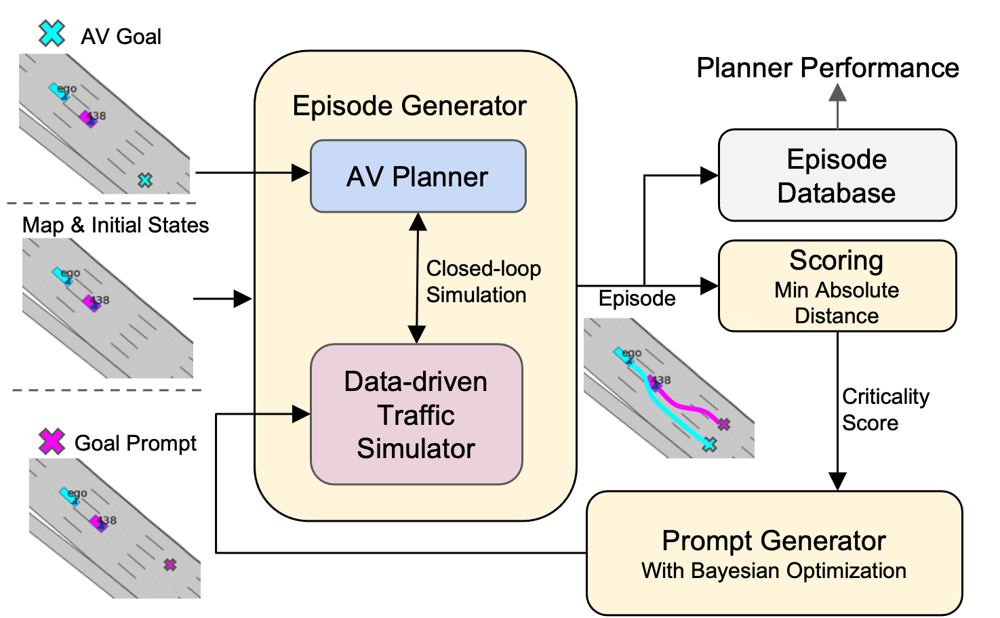

<em>Figure 1: Overview of the proposed framework with Prompt Generator, Episode Generator, and Episode Scorer modules.</em>

The framework is composed of three modules:
- **Prompt Generator**, which uses Bayesian Optimization to to search for critical goal prompts
- **Episode Generator**, generates simulations where the AV planner is tested against other agents governed by [ProSim](https://arxiv.org/abs/2409.05863) in a closed-loop manner.
- **Episode Scorer**, which quantifies criticality and feeds it back into BO.

<!-- 

  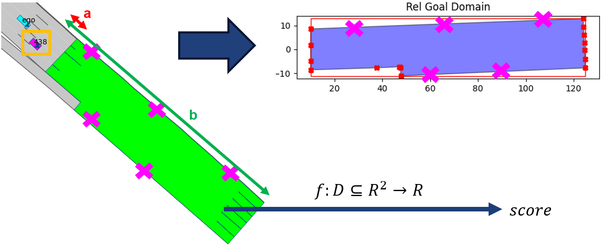

 -->

### Main Contributions
- **Modular pipeline** for automated planner evaluation using goal-based behavioral prompts.
- **Efficient discovery** of safety-critical interactions via BO over a low-dimensional domain.
- **Planner-agnostic** design: applicable to any AV planner with minimal assumptions.

  <strong>TL;DR</strong> 
  Given a fixed (yet customizable) initial scene configuration, the framework automatically 
  <strong>generates a set of informative and safety-critical episodes</strong> by optimizing the final goals of surrounding agents using Bayesian Optimization. These episodes are tailored to stress-test the AV planner in realistic, closed-loop simulations.

## Experiments

Three highway settings with different initial configurations of a single other vehicle. We proceed to run 75 iterations of Bayesian OptimizationFor each experiment, the image on the left shows the **initial scene setup**, while the image on the right displays the final **Gaussian Process mean** after **75 iterations of Bayesian Optimization**. 

<!-- Row 1 -->

  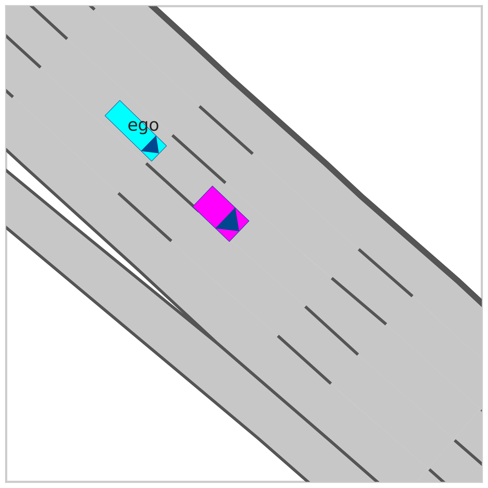
  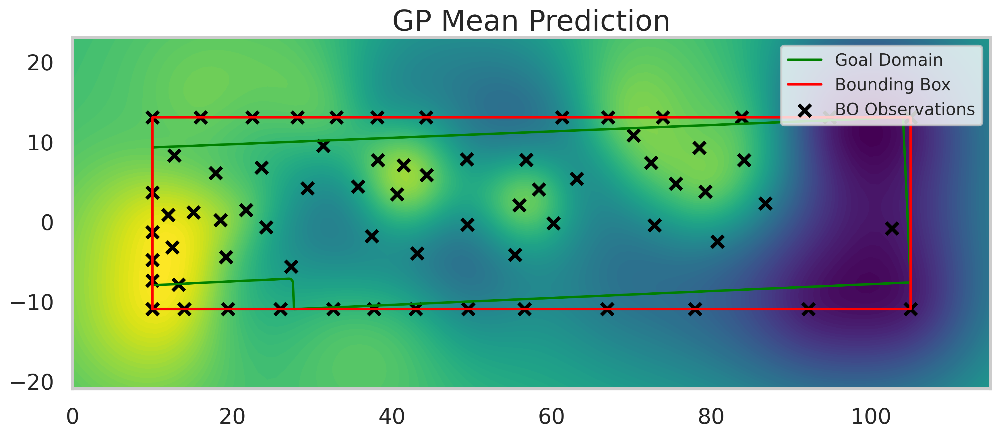

  <em>Experiment 1: Other agent is in front of the ego agent, in the same lane.</em>

<!-- Row 2 -->

  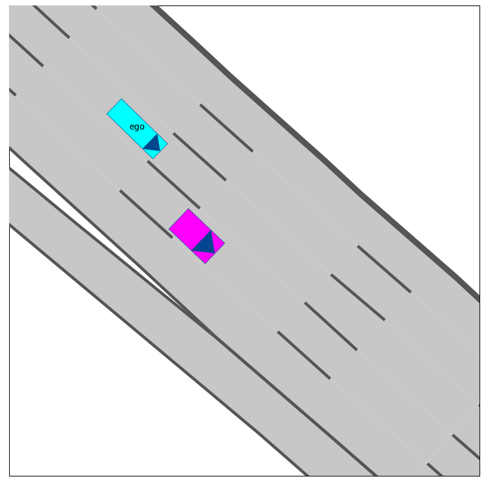
  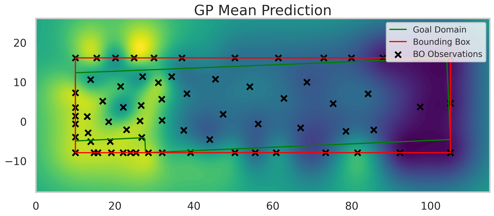

  <em>Experiment 2: Other agent is ahead the ego agent, in the adjacent right lane.</em>

<!-- Row 3 -->

  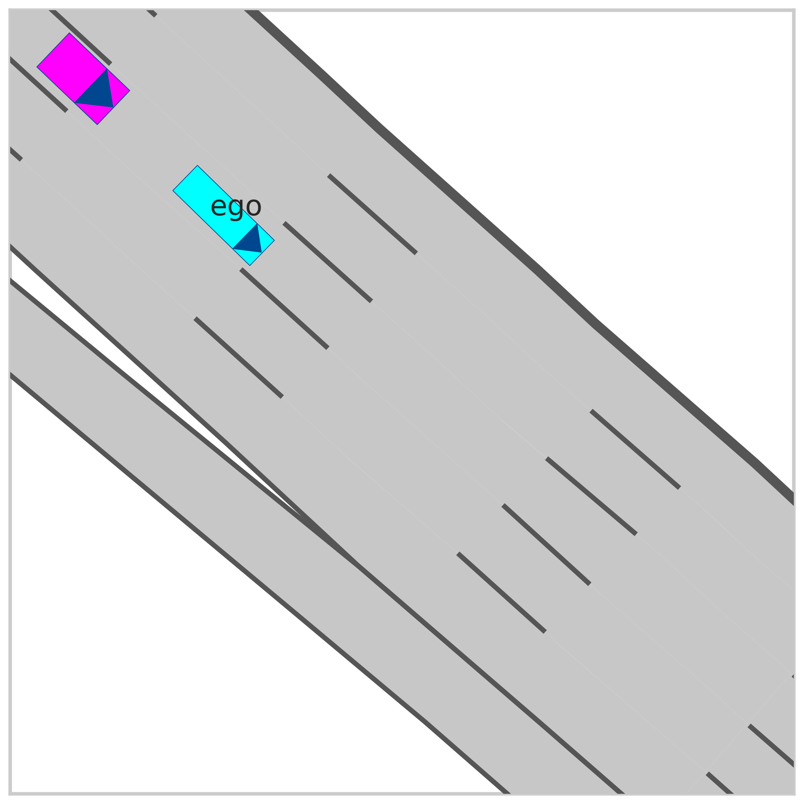
  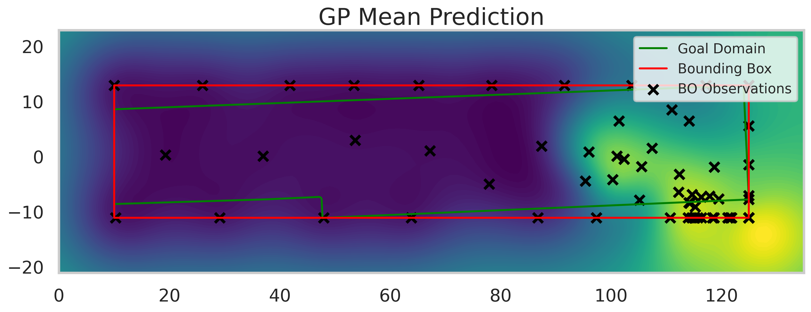

  <em>Experiment 3: Other agent is in the same lane, but behind the ego agent.</em>

### Examples of Generated Episodes

Below are showed a few examples of generated episodes featuring a collision between the ego agent governed by the planner and one other agent governed by [ProSim](https://arxiv.org/abs/2409.05863). 

The first two videos are drawn from Experiment 2, with the other agent starting front-right with respect to the planner. To assist with analysis, the planner’s prediction of the other agent’s state, updated at 2 Hz, is shown in **yellow**.

  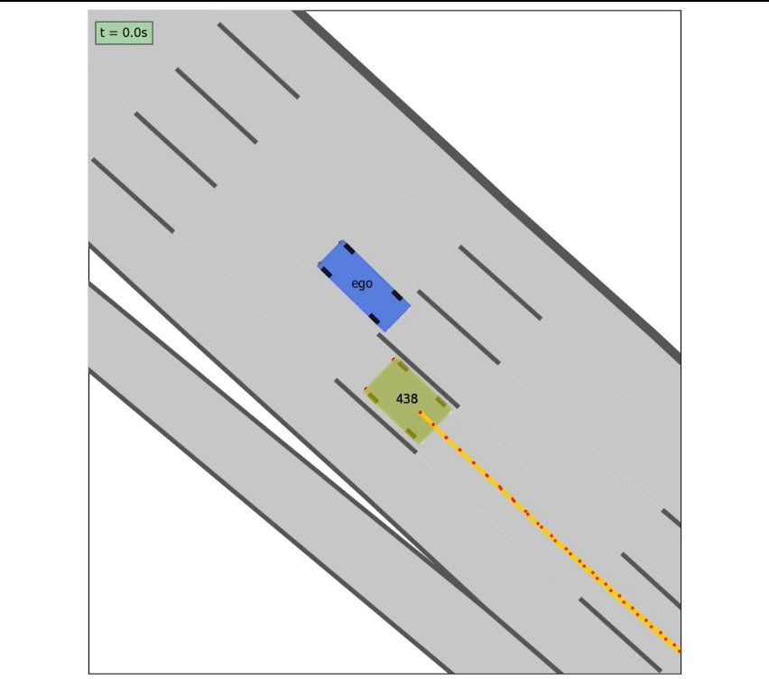
  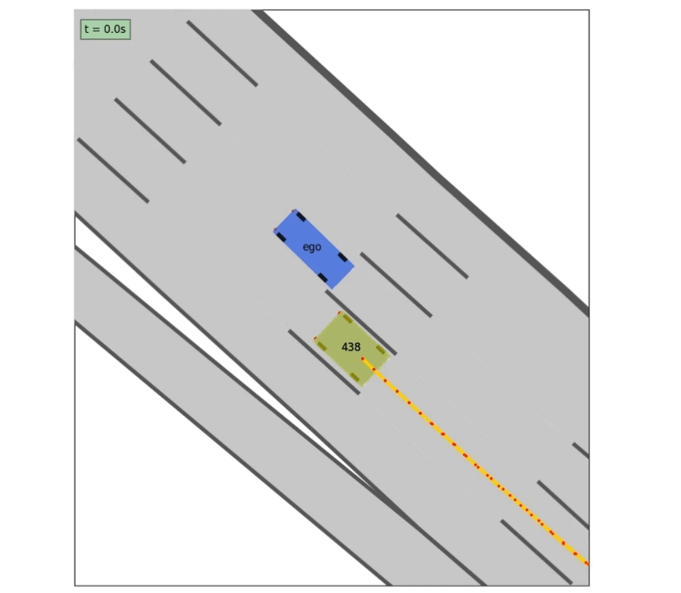

  <em>
    The planner initiates a lane change to the right to reach its goal, incorrectly assuming the other agent maintains speed. Collision occurs after the other agent suddenly brakes.
  </em>

In the first two videos, the collision occurs due to the other agent’s sudden braking and the planner’s incorrect assumption that the agent would maintain its speed. Such behaviors are common in real-world driving and can result from situations like an **animal crossing** or a **large pothole**.
In both cases, the ego agent initiates a lane change to the right to reach its goal further along the adjacent lane.

The next two videos are drawn from experiment 3, with the other agent starting behind the planner.

  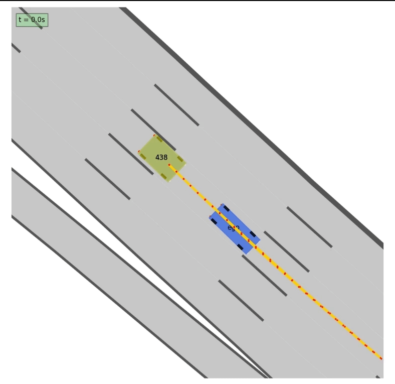
  

  <em>
    The other agent collides with the ego vehicle from behind, revealing the planner’s limited ability to react to unexpected rear threats.
  </em>

In these two videos, the collision is caused by a deliberate maneuver of the other agent, which intentionally collides with the ego vehicle. While these incidents are clearly not the planner's fault, they are valuable for exposing its **limited ability to react to unexpected threats from behind**. Such behaviors can arise from not-so-uncommon real-world causes, including driver **distraction**, **falling asleep** at the wheel, or sudden health issues.