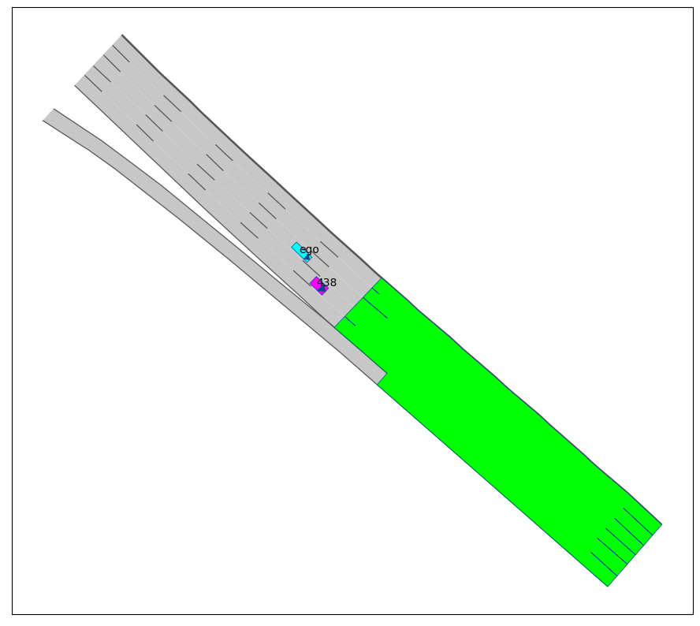

# Test Automation for Interactive Scenarios via Promptable Traffic Simulation

## Project Overview

This project introduces an **automated framework to generate diverse, realistic, and safety-critical test scenarios** for evaluating autonomous vehicle (AV) planners in interactive traffic situations. Unlike prior approaches that often trade off realism for adversariality or lack efficiency in exploring behaviors, this method unifies realism, criticality, interactivity, and diversity within a single scalable pipeline.

The key idea lies in exploiting a **promptable traffic model**, [ProSim](https://arxiv.org/abs/2409.05863), to **parametrize complex human driver behaviors through low-dimensional final position goal prompts**. These goal prompts are then optimized using **Bayesian Optimization (BO)** to efficiently discover critical yet plausible interactions that challenge the AV planner in **closed-loop simulations**.

  

<em>Figure 1: Overview of the proposed framework with Prompt Generator, Episode Generator, and Episode Scorer modules.</em>

The framework is composed of three modules:
- **Prompt Generator**, which uses Bayesian Optimization to to search for critical goal prompts
- **Episode Generator**, generates simulations where the AV planner is tested against other agents governed by [ProSim](https://arxiv.org/abs/2409.05863) in a closed-loop manner.
- **Episode Scorer**, which quantifies criticality and feeds it back into BO.

<!-- 

  

 -->

### Main Contributions
- **Modular pipeline** for automated planner evaluation using goal-based behavioral prompts.
- **Efficient discovery** of safety-critical interactions via BO over a low-dimensional domain.
- **Planner-agnostic** design: applicable to any AV planner with minimal assumptions.

### TL;DR
Given a fixed (yet customizable) initial scene configuration, the framework automatically generates a **set of informative and safety-critical episodes** by optimizing the final goals of surrounding agents using Bayesian Optimization. These episodes are tailored to stress-test the AV planner in realistic, closed-loop simulations.

---

## Examples of Generated Episodes

<!-- ### 🧪 Experimental Setup
- **AV Planner**: MPC-based (2 Hz), assumes constant-velocity, lane-centered behavior of others.
- **Simulator**: [ProSim](https://arxiv.org/abs/2409.05863) (pretrained, no fine-tuning), adapted for [CommonRoad](https://commonroad.in.tum.de/).
- **Scenarios**: 3 highway settings with different initial configurations of one other vehicle.
    -  **Front**: Other agent is in front of the AV in the same lane |
    - **Front-Right**: Other agent is ahead, in the adjacent right lane |
    - **Behind**: Other agent is in the same lane, but behind the AV |
- **Optimization**: 75 BO iterations per scenario (Matern kernel, UCB acquisition).
- **Metrics**:
  - **Safety-Criticality**: Collision rate, Min. Distance, Time-To-Collision (TTC)
  - **Diversity**: Average pairwise trajectory distance (ego & other agent)

--- -->

Below are showed a few examples of generated episodes featuring a collision between the ego agent governed by the planner and one other agent governed by [ProSim](https://arxiv.org/abs/2409.05863). In yellow is shown the planner's prediction of the other agent current state, updated at 2Hz and instrumental in analyzing the causes of the collision.

In the first two videos, the collision results from the other agent's sudden braking and the planner’s incorrect assumption about its velocity. This type of behavior is common in real-world scenarios and may be triggered by events such as an **animal crossing** or an unexpected road hazard like a **large pothole**.

  

  

In the next two videos, the collision is caused by a deliberate maneuver of the other agent, which intentionally collides with the ego vehicle. While these incidents are clearly not the planner's fault, they are valuable for exposing its **limited ability to react to unexpected threats from behind**. Such behaviors can arise from not-so-uncommon real-world causes, including driver **distraction**, **falling asleep** at the wheel, or sudden health issues.

  

  

<!-- 

  

 -->